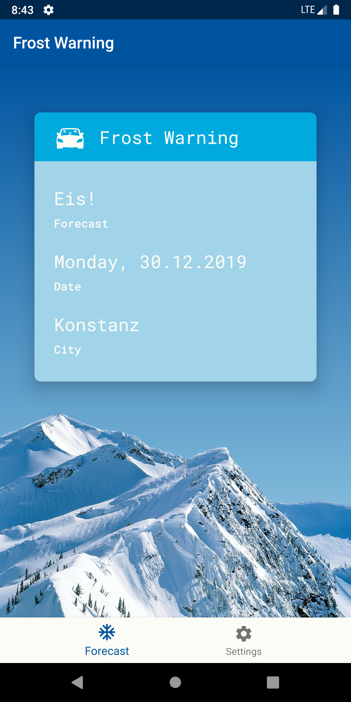
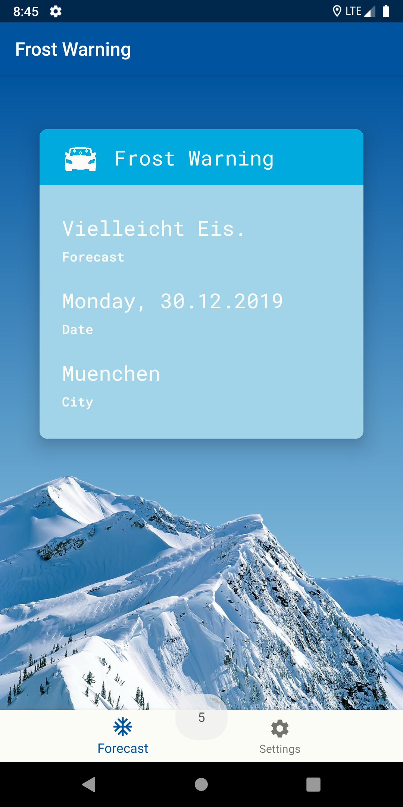
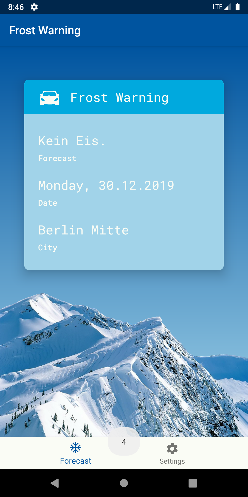
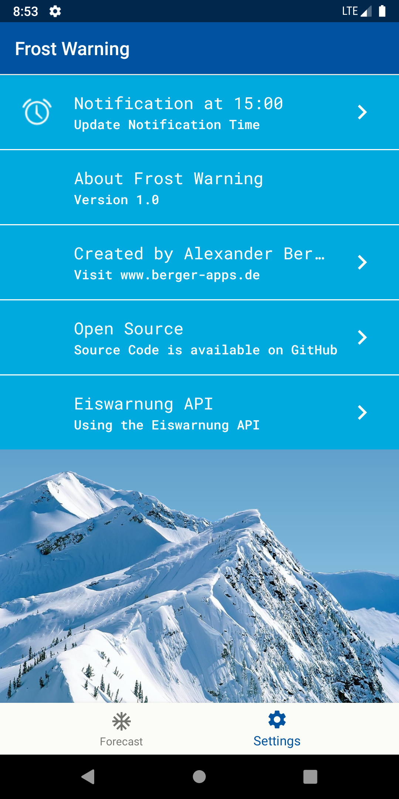
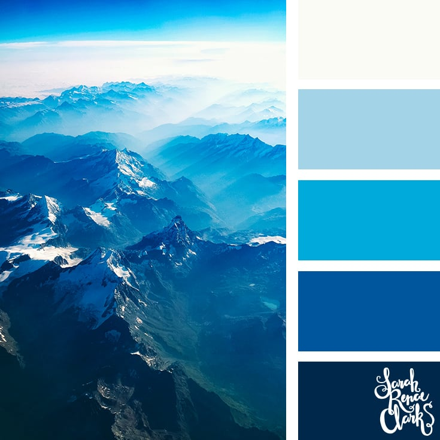

# icewarning-android
Frost Warning - Native Android App 

Eis             |  Vielleicht Eis | Kein Eis
:-------------------------:|:-------------------------:|:-------------------------:
  |   | 

Settings             |  Color Palette
:-------------------------:|:-------------------------:
  |   |

#### ko_fi: https://ko-fi.com/berger
#### buymeacoffee: https://www.buymeacoffee.com/RW5zuJI

## API
[Eiswarnung API](https://www.eiswarnung.de/rest-api/)
